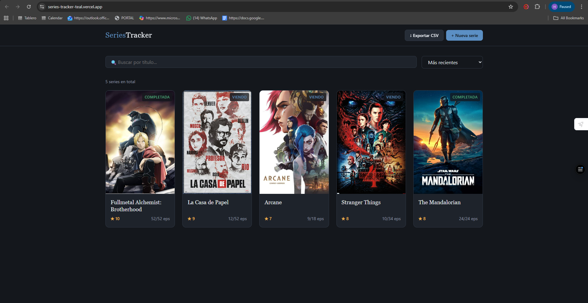
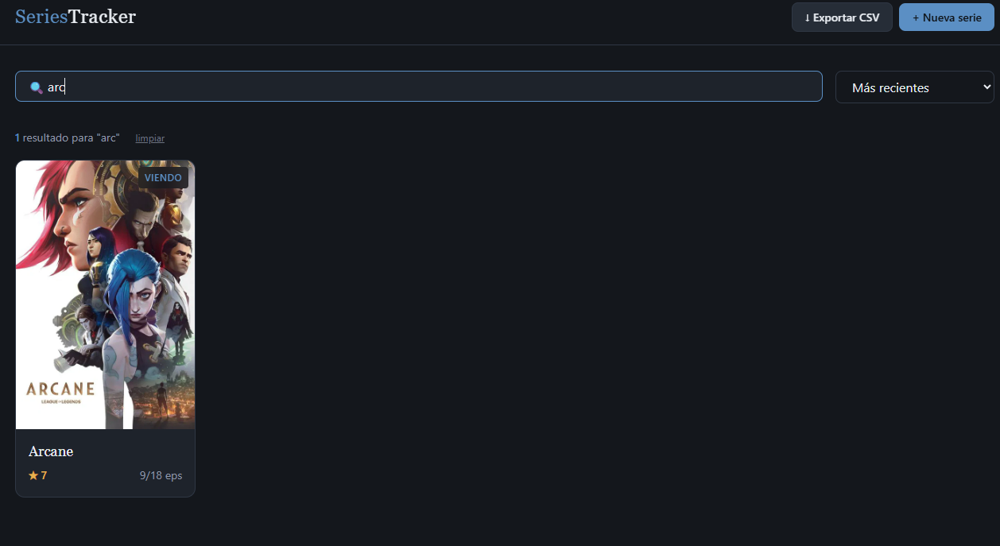

# Series Tracker — FRONTEND
-----------------------------------------------------------------------------------------------------------------------------------------------------
Cliente del proyecto Series Tracker. Permite gestionar visualmente una colección de series consumiendo la API REST mediante `fetch()` nativo.

**App desplegada:** https://series-tracker-teal.vercel.app  
**API backend:** https://series-tracker-api-production.up.railway.app  
**Repo del backend:** https://github.com/hmndz3/series-tracker-api

-----------------------------------------------------------------------------------------------------------------------------------------------------

## Screenshots






-----------------------------------------------------------------------------------------------------------------------------------------------------

## Stack

- HTML5 + CSS3 + JavaScript vanilla (sin frameworks ni librerías)
- `fetch()` nativo para hablar con la API
- Hosting: Vercel (deploy automático desde GitHub)

-----------------------------------------------------------------------------------------------------------------------------------------------------

## Funcionalidades

- Listar series en un grid estilo pósters
- Buscar por título con debounce (300ms)
- Ordenar por título, calificación o fecha de creación
- Paginación con botones anterior / siguiente
- Ver detalle de una serie en modal
- Crear nueva serie desde formulario
- Editar serie existente
- Eliminar serie con confirmación
- Exportar lista a CSV sin librerías
- Notificaciones toast para feedback de acciones
- Diseño responsivo (se adapta a móvil)

-----------------------------------------------------------------------------------------------------------------------------------------------------

## Estructura del proyecto

series-tracker-client/
├── index.html
├── css/
│   ├── tokens.css
│   ├── base.css
│   └── components.css
├── js/
│   ├── config.js
│   ├── api.js
│   ├── main.js
│   ├── modal.js
│   ├── detalle.js
│   ├── formulario.js
│   ├── exportar.js
│   └── toast.js
└── assets/
    └── screenshots/

-----------------------------------------------------------------------------------------------------------------------------------------------------

## Sobre CORS

El cliente y el backend corren en orígenes distintos (dominios y puertos diferentes cuentan como orígenes distintos). Por seguridad, el navegador bloquea peticiones `fetch()` entre orígenes a menos que el servidor lo permita con headers CORS. El backend envía los headers necesarios para autorizar al cliente.

-----------------------------------------------------------------------------------------------------------------------------------------------------

## Correr localmente (Windows)

### Opción recomendada: Live Server en VS Code

1. Clonar el repo:
```powershell
   git clone https://github.com/hmndz3/series-tracker-client.git
   cd series-tracker-client
```

2. Abrir la carpeta en VS Code:
```powershell
   code .
```

3. Instalar la extensión **Live Server** de Ritwick Dey (si no la tienes).

4. Click derecho sobre `index.html` → "Open with Live Server".

5. El sitio queda disponible en `http://127.0.0.1:5500`.

### Apuntar a un backend local

Por defecto `js/config.js` apunta al backend en Railway. Para usar uno corriendo local, edita el archivo:
```javascript
const CONFIG = {
    API_URL: "http://localhost:8080"
};
```

-----------------------------------------------------------------------------------------------------------------------------------------------------

## Challenges implementados

- Calidad visual — diseño oscuro con fichas tipo pósters.
- Exportar CSV (+20) — generación manual sin librerías, compatible con Excel.
- Organización del código — separación en módulos por responsabilidad, CSS con variables y convención BEM

El cliente también aprovecha los challenges implementados en el backend (paginación, búsqueda, ordenamiento) desde la UI.

-----------------------------------------------------------------------------------------------------------------------------------------------------

## Reflexión

La parte de construir el frontend fue la que más disfruté del proyecto. No usar frameworks se sintió raro al principio porque estoy acostumbrado a tener cosas ya resueltas, pero al hacerlo todo desde cero entendí mejor qué está pasando realmente cuando escribís una app web.

Lo que más tiempo me tomó fue pensar en cómo diseñarla visualmente. Quería que se viera como una app real y no como una tarea, así que pasé varios intentos hasta encontrar una paleta y una tipografía que se sintieran bien juntas. Al final me fui por algo oscuro con azul acero y serif para los títulos, y creo que quedó bastante decente.

Separar el JavaScript en varios archivos (`api.js`, `modal.js`, `formulario.js`, etc.) me ayudó mucho a no perderme. Al principio todo estaba en un solo archivo gigante y era un desastre encontrar las cosas. Después de partirlo se volvió más fácil agregar funcionalidades nuevas sin romper las que ya estaban.

La parte del CSV manual fue la más interesante técnicamente. Pensé que iba a ser más fácil pero había que escaparse las comas y las comillas bien para que Excel lo leyera correcto, y también agregar algo llamado BOM al inicio para que los acentos no salieran rotos. Cosas que no sabía que existían.

El deploy en Vercel fue lo más simple de todo el proyecto. Subí el repo y en segundos ya tenía un link público funcionando. No tuve que configurar nada raro.

Volvería a usar vanilla JS para proyectos chicos, pero para algo más grande seguro usaría React o algo parecido porque mantener el DOM actualizado a mano se vuelve pesado cuando hay muchas partes cambiando a la vez.
-----------------------------------------------------------------------------------------------------------------------------------------------------